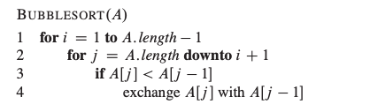

# CleuRoS: CLRS Pseudocode Language

This repo contains the design documents and a reference compiler of a new programming language CLeuRoS. The language aims at bridging the gap between the pseudocode in *Introduction to Algorithms* (CLRS) and actual programming languages such as C++.


**Currently, while the language's appearance is decent and might be an OK course project, it has no interesting features. In addition, the software design of the compiler is awfully flawed. I will do an in-depth investigation on how to improve it. More details will appear soon!**


## Bubble Sort in CLeuRoS

Bubble sort in CLeuRoS:

```
arr := [4, 5, 2, 1]
for i := 0 to arr.length - 2
		for j := arr.length - 1 downto i + 1
			if arr[j] < arr[j - 1]
				exchange arr[j] with arr[j - 1]
```

Bubble sort in CLRS:




## Compile Your CLeuRoS code

Tested on

- OCaml 4.12.0
- LLVM 13.0.0
- MacOS 11.x and 12.x


First, change to the `lib` directory. You should build the compiler `cleuros.native`. The compiler will accept a CLeuRoS source file and translate it to [LLVM IR](https://llvm.org/docs/LangRef.html).

```
$ cd lib
$ make
$ ./cleuros.native ../test/gcd.cl
```

Now you have a `gcd.out` file in `lib`. That is the LLVM IR of `gcd.cl`. You then can either interpret it using `lli` or compile it to assembly code using `llc`.

```
$ lli gcd.out
```

or

```
$ llc gcd.out -o gcd.s
$ gcc gcd.s -o gcd
$ ./gcd
```


Alteratively, in `lib`, you can generate and run an `*.out` LLVM bitcode for source program`<source.cl>` placed in `demo/` using

```
$ ./tester.sh gcd
$ lli gcd.out
GCD:
4
GCD:
7
GCD:
4
GCD:
256
```


---

The was originally a course project for [COMS4115 Programming Languages and Translators, Spring 2022](https://verigu.github.io/4115Spring2022/). The deliverable of the course project can be found at https://github.com/smeshoyrer/cleuros. Sam Meshoyrer and Brian Paick also contributed to the project.
